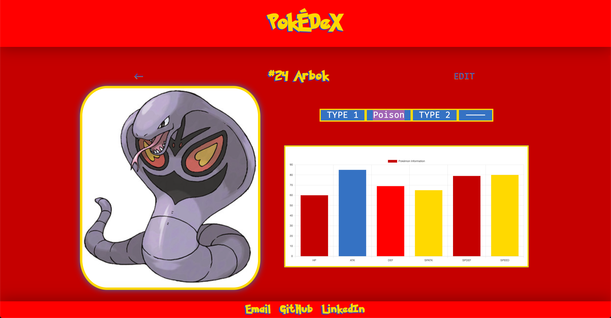

# PokeDex

[Click Here](http://localhost:3000) to get started

### Screenshots

### VALID KEYS
- User Authenticated Pages
    - Backspace - go back a page
- Dashboard
    - UP / DOWN
    - Enter

### TECHNOLOGIES USED
- HTML5 / CSS3
- [Charts.JS](https://www.chartjs.org)
- **Node Modules**
    - [bcrypt](https://www.npmjs.com/package/bcrypt)
    - [better-sqlite3](https://www.npmjs.com/package/better-sqlite3)
    - [better-sqlite3-session-store](https://github.com/TimDaub/better-sqlite3-session-store#readme)
    - [dotenv](https://www.npmjs.com/package/dotenv)
    - [ejs](https://www.npmjs.com/package/ejs)
    - [express](https://www.npmjs.com/package/express)
    - [express-session](https://github.com/expressjs/session)
    - [file-system](https://www.npmjs.com/package/file-system)
    - [method-override](https://www.npmjs.com/package/method-override)
- **Websites**
    - [Pokemon Colors](https://www.schemecolor.com/pokemon-colors.php)
    - [Text Shadow Generator](https://html-css-js.com/css/generator/text-shadow/)
    - [Box Shadow Generator](https://cssgenerator.org/box-shadow-css-generator.html)
    - [CSS Gradient](https://cssgradient.io)
    - [W3 Generator CSS Scrollbar](https://w3generator.com/scrollbar)
    - [FiraCode Font](https://github.com/tonsky/FiraCode)
    - [Pokemon Font](https://www.dafont.com/pokemon.font)

### TO-DO:
- 